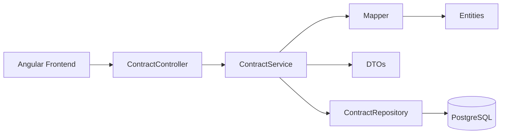
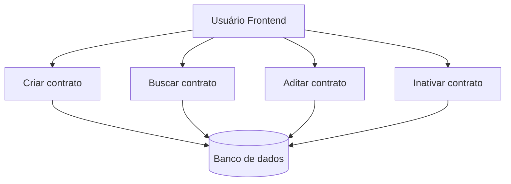

# 📄 Contract Management API


API REST para **gestão de contratos empresariais**, desenvolvida com **Java + Spring Boot** e integrada a um **frontend Angular**.

O sistema permite o gerenciamento básico de contratos empresariais através das seguintes operações:

* Criar contratos
* Consultar contratos
* Realizar aditamento de contratos
* Inativar contratos

A aplicação também implementa regras básicas de negócio como:

* unicidade de contrato ativo por CNPJ
* geração automática do número do contrato
* mascaramento de CNPJ
* inativação lógica de contratos

---

# 🏗 Arquitetura da aplicação



Fluxo da aplicação:

```
Frontend → Controller → Service → Repository → Database
```

---

# ⚙ Tecnologias utilizadas

## Backend

* Java 21
* Spring Boot
* Spring Web
* Spring Data JPA
* Hibernate
* MapStruct
* Lombok
* Bean Validation
* PostgreSQL
* Maven
* Docker

## Frontend

* Angular
* Reactive Forms
* HttpClient

---

# 📋 Requisitos para executar a aplicação

Para executar o projeto localmente é necessário possuir as seguintes ferramentas instaladas.

## Backend

| Ferramenta     | Versão recomendada |
| -------------- | ------------------ |
| Java           | 21                 |
| Maven          | 3.9+               |
| Docker         | 24+                |
| Docker Compose | 2+                 |

## Frontend

| Ferramenta  | Versão recomendada |
| ----------- | ------------------ |
| Node.js     | 18+                |
| npm         | 9+                 |
| Angular CLI | 17+                |

---

# 🔎 Verificando instalação das ferramentas

### Java

```
java -version
```

### Maven

```
mvn -version
```

### Node

```
node -v
```

### npm

```
npm -v
```

### Docker

```
docker -v
```

### Docker Compose

```
docker compose version
```

---

# 🚀 Executando a aplicação

## 1. Clonar o projeto

```
git clone https://github.com/pedrocaah/fit-contract-menagement.git
```

---

## 2. Build da aplicação

```
mvn clean install
```

---

## 3. Executar aplicação

```
mvn spring-boot:run
```

---

## 4. Executar banco via Docker

```
docker compose up -d
```

---

## 5. Subir FED via npm

```
npm install
npm run
```

---

# 🌐 Frontend

O frontend Angular possui quatro telas principais:

| Tela              | Função                      |
| ----------------- | --------------------------- |
| Criar contrato    | cadastro de novos contratos |
| Buscar contrato   | consulta por número         |
| Aditar contrato   | atualização de dados        |
| Inativar contrato | inativação lógica           |

Cada tela consome diretamente os endpoints da API.

---

# 📡 Endpoints da API

## Criar contrato

```
POST /contracts
```

### Request

```json
{
  "numberCnpj": "12345678000199",
  "enterpriseName": "Empresa XPTO",
  "legalName": "Empresa XPTO LTDA",
  "enterpriseAdress": "Av Paulista 1000",
  "nameCEO": "João da Silva"
}
```

### Response

```
201 Created
```

### Regras de negócio

* contrato é criado com **status ATIVO**
* não é permitido mais de um **contrato ativo por CNPJ**
* número do contrato é **gerado automaticamente**
* data de criação é **gerada automaticamente**
* CNPJ retornado é **mascarado**

---

## Buscar contrato

```
GET /contracts/{contractNumber}
```

### Response

```json
{
  "contractNumber": "123456780001",
  "numberCnpj": "12.345.678/0001-99",
  "enterpriseName": "Empresa XPTO",
  "legalName": "Empresa XPTO LTDA",
  "enterpriseAdress": "Av Paulista 1000",
  "nameCEO": "João da Silva",
  "status": "ATIVO",
  "createdAt": "2026-03-02T14:33:00"
}
```

### Regras

* busca realizada pelo **número do contrato**
* caso não exista retorna **404**

---

## Aditar contrato

```
PUT /contracts/{contractNumber}
```

### Request

```json
{
  "enterpriseName": "Empresa XPTO Atualizada",
  "legalName": "Empresa XPTO LTDA",
  "enterpriseAdress": "Av Paulista 2000",
  "nameCEO": "Maria Silva"
}
```

### Response

```
200 OK
```

### Regras

* contrato localizado pelo **contractNumber**
* caso não exista retorna **404**

---

## Inativar contrato

```
PATCH /contracts/{contractNumber}
```

### Response

```
204 No Content
```

### Regras

* contrato **não é removido do banco**
* status alterado para **INATIVO**
* caso não exista retorna **404**

---

# 🔄 Fluxo de operações do contrato



---

# 🗄 Estrutura do banco de dados

Tabela principal

```
contract
```

Campos principais

| Campo            | Descrição          |
| ---------------- | ------------------ |
| id               | UUID do contrato   |
| contractNumber   | número do contrato |
| numberCnpj       | CNPJ da empresa    |
| enterpriseName   | nome da empresa    |
| legalName        | razão social       |
| enterpriseAdress | endereço           |
| nameCEO          | nome do CEO        |
| status           | status do contrato |
| createdAt        | data de criação    |

---

# 👨‍💻 Autor

Pedro Oliveira

Projeto desenvolvido para fins acadêmicos.
